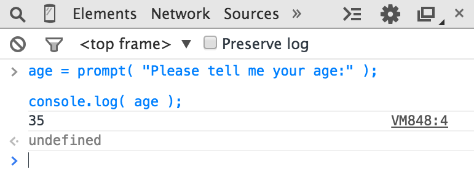

# You Don't Know JS: Up & Going
# Capítulo 1: Hacia la programación

Bienvenido a la serie *You Don't Know JS* (*YDKJS*).

*Up & Going* es una introducción a varios conceptos básicos de programación. -- por supuesto nos inclinamos hacia JavaScript (a menudo abreviado JS) específicamente -- y cómo abordar y entender el resto de los títulos de esta serie. Especialmente si está empezando en programación y / o JavaScript, este libro explorará brevemente lo que necesita para para *ponerte en marcha*.

Este libro comienza explicando los principios básicos de la programación a un nivel muy alto. Está pensado sobre todo si usted está comenzando *YDKJS* con poca o ninguna experiencia previa de programación, y está buscando estos libros para ayudarle a comenzar a lo largo de un camino a la comprensión de la programación a través de la lente de JavaScript.

El capítulo 1 debería ser abordado como una visión general rápida de las cosas que querrá aprender y practicar para *entrar en la programación*. Hay también otras muchos recursos fantásticos de introduccíon a la programación que pueden ayudarle a profundizar más en estos temas y le animo a que aprenda de ellos, además de este capítulo.

Una vez se sienta cómodo con los fundamentos generales de la programación, el capítulo 2 le ayudará a familiarizarse con el savor de la programación en JavaScript. El capítulo 2 introduce de qué va JavaScript, pero una vez más, no es una guía comprensiva -- ¡para eso están el resto de libros de *YDKJS*!

Si ya se siente bastante cómodo con JavaScript, revise primero el capítulo 3 con lo que puedes esperar de *YDKJS*, y ¡sumerjase directamente!

## Código

Empecemos por el principio.

Un programa, a menudo denominado *codigo funete* o simplemente *codigo*, es un conjunto de instrucciones especiales para decirle a la computadora que tareas realizar. Por lo general el código se guarda en un archivo de texto, aunque con JavaScript también puede escribir código directamente en la consola de desarrollo del navegador, algo que cubriremos en breve.

Las reglas para el formato válido y combinaciones de instrucciones se denomina *lenguaje de programación*, aveces conocido como *sintaxis*, del mismo modo que en inglés le dice como deletrear palabras y como crear oraciones válidas unsando palabras y signos de puntuación.

### Sentencias / Statements

En un lenguaje de programación, un grupo de palabras, númneros, y operadores que realizan una tarea específica es una *sentencia* (statement). En JavaScript, una sentencia puede tener el siguiente aspecto:

```js
a = b * 2;
```

Los caracteres `a` y `b` son llamados *variables* (ver "Variables"), que son como simples casillas en las que se puede almacenar cualquier cosa. En los programas, las variables contienen valores (como el número `42`) para ser utilizado por el programa. Pienese en ellas como marcadores simbolicos de los valores mismos.

Por el contrario, el `2` es solo un valor en si mismo, llamado un *valor literal*, porque está solo sin ser almacenadoen una variable.

Los caracteres `=` y `*` son *operadores* (Ver "Operadores") -- realizan acciones con los valores y variables como la asignación y la multiplicación matemática.

La mayoría de sentencias en JavaScript concluyen con un punto y coma (`;`) al final.

La sentencia `a = b * 2;` le dice al ordenador, aproximadamente, que recoja el valor actual almacenado en la variable `b`, que multipique ese valor por `2`, y luego almacene el resultado en otra variable que llamamos `a`.

Los programs son solo colecciones de muchas de estas sentencias, que en conjunto describen todos los pasos necesarios para cuplir con el propósito del programa.

### Expresiones

Las sentencias (statements) se componen de una o más *expresiones*. Una expresión es cualquier referencia a una variable o valor, o un conjunto de de variables y valores combinados con operadores.

Por ejemplo:

```js
a = b * 2;
```

Esta sentencia tiene cuatro expresiones:

* `2` es una *expresión de valor literal*
* `b` es una  *expresión variable*, que significa que recoje su valor actual
* `b * 2` es una  *expresión aritmética*, que significa hacer la multiplicación
* `a = b * 2` es una *expresión asignación*, que significa asignar el resultado de la expresión `b * 2` a la variable `a` (más sobre asignaciones más adelante)

Una expresión general que sobresale por si sola también se llama *expresión de sentencia*, como la siguiente:

```js
b * 2;
```

Este tipo de expresión de sentencia no es muy común o útil, ya que normalmente no tendría ningún efecto en la ejecución del programa -- devolvería el valor de `b` y lo multiplicaría por `2`, pero luego no haría nada con ese resultado.

Una expresión de sentencia más común es una sentencia de *expresión de llamada* (ver "Funciones"), ya que la sentencia completa es la expresión de llamada de la función en sí misma:

```js
alert( a );
```

### Ejecución de un Programa

¿Cómo hace esa colección de sentencias para decirle al ordenador que debe hacer? El programa debe ser *ejecutado*, también llamado *correr el programa*.

Sentencias como `a = b * 2` son útiles para los desarrolladores cuando leen y escriben, pero en realidad no está en un formato que el ordenador pueda interpretar directamente. Por ello se utiliza una utilidad especial de los ordenadores (ya sea un *interprete* o un *compilador*) para traducir el código que escribe a comandos que un ordenador pueda interpretar.

Para algunos lenguajes de programación, esta traducción de comandos se hace normalmente desde arriba hacia abajo, linea a linea, cada vez que se ejecuta el programa, lo que se conoce normalmente como *interpretación* del código.

Para otros lenguajes, la traducción se hace con anticipación, llamada *compilación* del código, de modo que cuando se *ejecuta* más tarde, lo que se está ejecutando en realidad son las instrucciones compiladas y listas para usar.

Típicamente se afirma que JavaScript es *interpretado*, porque su código fuente JavaScript es procesado cada vez que se ejecuta. Pero eso no es del todo exacto. Actualmente el motor de JavaScript *compila* sobre la marcha e inmediatamente ejecuta el código compilado.

**Nota:** Para más información sobre la compilación de JavaScript, consulter los primeros dos capítulos del título *Scope & Closures* de esta serie.

## Inténtelo usted mismo

Este capítulo introduce cada concepto de programación con fragmentos de codigo simples, todos escritos en JavaScript (¡obviamente!)

No se puede enfatizar lo suficiente: mientras usted aborda este capítulo -- y puede que necesite pasar tiempo para repasarlo varias veces -- debería practicar cada uno de estos conceptos escribiendo el codigo usted mismo. La forma más fácil de hacerlo es abrir la consola de desarrollo de su navegador (Firefox, Chrome, IE, etc.).

**Sugerencia:** Normalmente, puede iniciar la consola de desarrollo con un atajo de teclado o desde una opción del menú. Para obtener información más detallada sobre cómo
iniciar y utilizar la consola en su navegador favorito, consulte "Dominio de la Consola de Herramientas Para Desarrolladores" (http://blog.teamtreehouse.com/mastering-developer-tools-console). Para escribir varias líneas en la consola de una vez, utilice `<shift> + <enter>` para pasar a la siguiente línea. Una vez que presione `<enter>`, la consola ejecutará todo lo que haya escrito.

Familiaricémonos con el proceso de ejecutar código en la consola. Primero le sugiero abrir una ventana vacía del navegador. Prefiero hacer esto escribiento `about:blank` en la barra de dirección. A continuación, asegúrese de que su consola de desarrollador esté abierta, como hemos mencionado.

Ahora, escriba este código y vea como funciona:

```js
a = 21;

b = a * 2;

console.log( b );
```

Escribir código anterior en la consola de Chrome debería producir algo como lo siguiente:


Vamos, inténtelo. ¡La mejor forma de aprender a programar es empezar a escribir código!

### Salida / Output

En el fragmento de código anteror, hemos utilizado `console.log(..)`. Brevemente, veamos de que se trata esa línea de código.

Puede que lo haya adivinado, pero así es exactamente como imprimimos el texto (también conocido como *salida* del usuario) en la consola. Hay dos características de esa sentencia que deberíamos explicar.

En primer lugar, la parte `log( b )` se denomina como una llamada a una función (ver "Funciones"). Lo que está sucediendo es que estamos pasando la variable `b` a la función, que le pide que tome el valor de `b` y lo imprima en la consola.

En segundo lugar, la parte `console.` es una referencia al objecto donde se encuentra la función `log(..)`. Cubrimos los objetos y sus propiedades con más detalle en el capítulo 2.

Otra forma de crear una salida que se pueda ver es ejecutando una sentencia `alert(..)`. Por ejemplo:

```js
alert( b );
```

Si lo ejecuta, notará que en lugar de imprimir la salida en la consola, muestra un diálogo emergente "OK" con el contenido de la variable `b`. En cualquier caso, utilizar `console.log(..)` normalmente hará más fácil aprender a codificar y ejecutar sus programas que utilizando `alert(..)`, porque pude imprimir varios valores a la vez sin interrumpir la interfaz del navegador.

En este libro, utilizaremos `console.log(..)` para la salida.

### Entrada / Input

Mientras discutiamos la salida, puede que se haya preguntado sobre la *entrada* (i.e., receiving information from the user).

La forma más común de hacerlo es hacer que la página HTML muestre elementos de formulario (como cuadros de texto) al usuario donde puea escribir, y posteriormente haciendo uso de JavaScript asignar esos valores a variables del programa.

Pero hay una manera más sencilla de obtener una entrada para casos de aprendizaje y demostraciones, tal y como hará a lo largo de este libro. Utilice la función `prompt(..)`:

```js
age = prompt( "Please tell me your age:" );

console.log( age );
```

Como debe suponer, el mensaje que pasa al `prompt(..)` -- en este caso, `"Please tell me your age:"` -- se imprime en el popup.

Debería parecerse a lo siguiente:


Una vez envie el texto haciendo click en "OK," observará que el valor que ha escrito se almacena en la variable `age`, que podemos *imprimir* con `console.log(..)`:



Para simpmplificar mientras aprendemos los conceptos básicos de programación, los ejemplos del libro no necesitarán entrada. Pero ahora que ha visto como utilizar `prompt(..)`, si quiere desafiarse a si mismo puede intentar utilizar entradas cuando explore los ejemplos.

## Operadores

Con los operadores es como realizamos acciones sobre variables y valores. Ya hemos visto dos operadores de JavaScript, el `=` y el `*`.

El operador `*` realiza la multiplicación matemática. Bastante simple, ¿verdad?

El operador igual `=` se utiliza para *assignar* -- primero calculamos el valor en *lado derecho* (valor de la asignación) del `=` y después lo ponemos en la variable que hemos especificado en el *lado izquierdo* (variable destino).

**Advertencia:** Esto puede parecer como un extraño orden inverso para especificar una asignación. En lugar de `a = 42`, algunos peden preferir voltear el orden para que el valor fuente esté a la izquierda y la variable de destino a la derecha, como `42 -> a` (¡Esto no es válido en JavaScript!). Desafortunadamente, la forma ordenanda `a = 42`, variaciones similares, prevalece en los lenguajes de programación moderno. Si lo siente poco natural, simplemente invierta un poco de tiempo practicando en su mente para acostumbrarsee.

Considerando:

```js
a = 2;
b = a + 1;
```

Aquí, asignamos el valor `2` a la variable `a`. Entonces, recuperamos el valor de la variable `a` (todavía `2`), le sumamos `1` dando como resultado el valor `3`, después almacenamos ese valor en la variable `b`.

Aunque no sea técnicamente un operador, necesitará la palabra clave `var` en cada programa, ya que es la principal forma de *declarar* (o *crear*) *variables* (ver "Variables").

Siempre debería declarar la variable por el nombre antes de utilizarla. Pero solo necesita hacerlo una vez por cada *ámbito* o *scope* (ver "Scope"); después puede utilizarla tantas veces como necesite. Por ejemplo:

```js
var a = 20;

a = a + 1;
a = a * 2;

console.log( a );	// 42
```

Estos son algunos de los operadores más comunes en JavaScript:

* Asignación: `=` as in `a = 2`.
* Matemaáticos: `+` (suma), `-` (resta), `*` (multiplicación), y `/` (division), como en `a * 3`.
* Asignación Compuesta: `+=`, `-=`, `*=`, y `/=` son operadores compuestos que combinan una operación matemática con una asignación, como en `a += 2` (igual a `a = a + 2`).
* Incremento/Decremento: `++` (incremento), `--` (decremento), como en `a++` (similar a `a = a + 1`).
* Acceso a Propiedad del Objeto: `.` como en `console.log()`.

   Los objetos son valores que mantienen otros valores en lugares específico llamados propiedades. `obj.a` hace referencia a una propiedad llamada`a` de un objeto llamado `obj`. Una forma alternativa de acceder a las propiedades es `obj["a"]`. Ver capítulo 2.
* Igualdad: `==` (iguales), `===` (estrictamente iguales), `!=` (no iguales), `!==` (no estrictamente iguales), como en `a == b`.

   Ver "Values & Types" y el capítulo 2.
* Comparación: `<` (menor que), `>` (mayor que), `<=` (menor o igual que), `>=` (mayor o igual que), como en `a <= b`.

   Ver "Values & Types" y el capítulo 2.
* Lógicos: `&&` (y), `||` (o), como en `a || b` que selecciona ya sea `a` *o* `b`.

   Estos operadores se utilizan para expresar condicionales compuestos (ver "Condicionales"), como si `a` *o* `b` son true (verdaderos).

**Nota:** Para más detalle, y cobertura de operadores no menionados aquí, consulte the Mozilla Developer Network (MDN)'s "Expressions and Operators" (https://developer.mozilla.org/en-US/docs/Web/JavaScript/Guide/Expressions_and_Operators).

## Valores & Tipos

Si le pregunta a un empleado de una tienda de teléfonos cuanto cuesta cierto telefono, y le responde "noventa y nueve con noventa y nueve" (es decir, $99.99), le está dando una cifra numérica real en dolares, que representa lo que tendrá que pagar (más impuestos) para comprarlo. Si desea comprar dos telefonos, puede realizar el calculo mental facilmente y duplicar ese valor para obtener $199.98 como precio base.

Ese mismo empleado coge otro teléfono similar pero dice que es "gratis" (quizas entrecomillandolo). No le está dando un númnero, en su lugar utiliza otro tipo de representación del coste ($0.00) -- la palabra "gratis."

Cuando más tarde pregunte si el telefono incluye cargador la respuesta podria haber sido "sí" o "no".

De forma muy parecida, cuando expresa valores en un programa, puede elegir diferentes representaciones de esos valores en función de lo que piensas hacer con ellos.

Estas diferentes representaciones de los valores se llaman *tipos* en terminología computacional. JavaScript tiene tipos incorporados para cada uno de estos llamados valores *primitivos*:

* Cuando necesita calculos matemáticos, necesita un `number` -- númnero --.
* Cuando necesita imprimir un valor en pantalla, necesita a `string` -- cadena de texto -- (uno o más caracteres, palabras, frases).
* Cuando necesita tomar una decisión en su programa, necesita un `boolean` -- booleano -- (tipo de dato lógico cuyo valor será `true`, verdadero o `false`, falso).

Los valores incluidos directamente en el código fuente se llaman *literales*. Los literales de tipo `string` se escriben entrecomillados por comillas dobles `"..."` o simples  (`'...'`) -- la única diferencia es una preferencia de estilo. Los literales `number` y `boolean`  se presentan tal como son (es decir, `42`, `true`, etc.).

Considerando:

```js
"I am a string";
'I am also a string';

42;

true;
false;
```

Más allá de los vlores de tipo `string`/`number`/`boolean`, es común en los lenguajes de programación proporcione *arrays*, *objects*, *functions*, y más. Abordaremos con más profundidad sobre valores y tipos a lo largo de éste y el próximo capítulo.

### Conversión Entre Tipos

Si tiene un `number` pero necesita imprimirlo en pantalla, necesita convertir su valor a tipo `string`, y en JavaScript esta conversión se concoce como "coercion" --forzar --. Del mismo modo, si alguien introduce una serie de caracteres numéricos en un formulario en una página de comercio electrónico, eso sería un `string`, pero si necesita utilizar ese valor en operaciones matemáticas, necesita *forzar* la conversión a `number`.

JavaScript porporciona varias utilidades diferentes para forzar la conversión entre *typos*. Por ejemplo:

```js
var a = "42";
var b = Number( a );

console.log( a );	// "42"
console.log( b );	// 42
```

Itilizar `Number(..)` (una función propia de JavaScript) como se muestra es una conversión forzada *explícita* a un tipo `number` desde cualquier otro. Eso debería ser bastante sencillo.

Pero un tema controvertido es cuando intenta comparar dos valores que actualmente no son del mismo tipo, lo que requeriría una conversión forzada *implícita*.

Al comparar la acdena `"99.99"` con el número `99.99`, la mayoría de la gente estaría de acuerdo que son equivalentes. Pero no son iguales exactamente, ¿verdad? Es el mismo valor representado de dos formas diferentes, dos *tipos* diferentes. Podrías decir que son "vagamente iguales", ¿no?

Para ayudarle en estas situaciones comunes, JavaScript aveces se activará e *implicitamente* forzará la conversión de valores a los tipos correspondientes.

Así que si utiliza el operador de igualdad laxo `==` para realizar la comparación `"99.99" == 99.99`, JavaScript convertirá el lado izquierda `"99.99"` a su `number` equivalente `99.99`. La comparación se convierte entonces en `99.99 == 99.99`, lo cual es por supuesto `true`.

Aunque diseñado para ayudarle, la *conversión forzada implícita* puede crear confusión si no se toma su tiempo en aprender las reglas que rigen este comportamiento. La mayoría de los desarrolladores en JavaScript nunca lo han hecho, así que la sensación común es que está confundiendo y perjudicando a los programas con errores inesperados, y debería ser evitada. Incluso, aveces, se considera un defecto en el diseño del lenguaje.

En cuaquier caso, la conversión forzada implícita es un mecanismo que *debería ser aprendido* que desee tomarse en serio la programación en JavaScript. No solo no es confuso una vez que se aprenden las reglas, ¡sino que puede hacer sus programas mejores! El esfuerzo vale la pena.

**Nota:** Para más información sobre la *conversión forzada*, ver el capítulo 2 de este título y el capítulo 4 del título *Types & Grammar* de esta serie.

## Comentarios de código

El empleado de la tienda de teléfonos podría apuntar algunas notas sobre las características de un teléfono recién lanzado o sobre los nuevos planes que su compañía ofrece. Esas notas son solo para el empleado -- no son para ser leídas por los clientes. Sin embargo, esas notas ayudan al empleado a hacer mejor su trabajo al documentar los cómos y los porqués que debería decirle a los clientes.

Una de las lecciones más importantes que puede aprender sobre escribir código es que no es solo para el ordenador. El código es tanto o más para el desarrollador que para el compilador.

Su ordenador solo se preocupa del código máquina, una serie binaria de 1s y 0s, resultado de la *compilación*. Hay un número casi infinito de programas que se podrían escibir que producen la misma serie de 1s y 0s.Las decisiones que tome sobre cómo escribir su programa son importantes -- no solo para usted,sno para el resto de miembros de su equipo e incluso para usted en un futuro.

Debería esforzarse no solo en escribir programas que funcionen correctamente, sino programas qye tengan sentido al ser examinados. Puede avanzar mucho en ese esfuerzo eligiendo buenos nombre para sus variables (ver "Variables") y funciones (ver "Funciones").

Pero otra parte importante son los comentarios de código. Estos son fragmentos de texto en su programa que se insertan únicamente para explicar las cosas a un humano. El interprete/compilador ignorará estos comentarios siempre.

Hay muchas opiniones sobre lo que hace un código bien comentado; Realmente no podemos definir reglas universales absolutas. Pero algunas observaciones y pautas son bastante útiles:

* El código sin comentarios es poco óptimo.
* Demasiados comentarios (uno por línea, por ejemplo) probablemente es signo de código pobremente escrito.
* Los comentarios deberían explicar el *porqué*, no el *qué*. Opcionalmente puede explicar el *cómo* si es particularmente confuso.

En JavaScript, hay dos tipos de comentarios posibles: comentario de una sola línea y comentarios multilínea.

Considerando:

```js
// This is a single-line comment

/* But this is
       a multiline
             comment.
                      */
```

El comentario de una sola línea `//` es apropiado si va a ponerlo justo encima de una única sentencia, o incluso al final de una línea. Todo en la línea después del `//` es tratado como un comentario (y por tanto ignorado por el compilador), hasta el final de la línea. No hay restricción a lo que puede aparecer dentro de un comentario de una sola línea.

Considerando:

```js
var a = 42;		// 42 is the meaning of life
```

El comentarios multilínea `/* .. */` multiline comment es apropiado si tiene varias líneas de explicación para hacer en su comentario.

Aquí es un uso común de comentarios multilínea:

```js
/* The following value is used because
   it has been shown that it answers
   every question in the universe. */
var a = 42;
```

También puede aparecer en cualquier lugar de una línea, incluso en medio de la misma, porque el `*/` lo finaliza. Por ejemplo:

```js
var a = /* arbitrary value */ 42;

console.log( a );	// 42
```

Lo único que no puede aparecer dentro de un comentario multilínea es un `*/`, porque eso se interpretaría para terminar el comentario.

Definitivamente, deseará comenzar su aprendizaje en programación comenzando con el hábito de comentar el código. A lo largo del resto de este capítulo, verá que uso comentarios para explicar cosas, así que haga lo mismo en su propia práctica. ¡Confíe en mí, todos los que lean su código te lo agradecerán!

## Variables

La mayoría de los programas útiles deben rastrear un valor a medida que cambia a lo largo del programa, sometiéndose a diferentes operaciones según lo requieran las tareas previstas de su programa.

La forma más sencilla de hacerlo en su programa es asignar un valor a un contenedor simbólico, llamado *variable*, llamado así porque el valor en este contenedor puede *variar* con el tiempo según sea necesario.

En algunos lenguajes de programación, declara que una variable (contenedor) contiene un tipo específico de valor, como `number` o `string`. El *tipado estática*, también conocido como *forzado de tipo*, se cita generalmente como un beneficio para la precisión del programa al evitar la conversión de valores no deseadas.

Otros lenguajes enfatizan tipos para valores en lugar de variables. El *tipado débil* -- Weak typing --, también conocido como *tipado dinámico*, permite que una variable contenga cualquier tipo de valor en cualquer momento. Por lo general, se cita como un beneficio para la flexibilidad del programa al permitir que una sola variable represente un valor, independientemente del tipo de forma que ese valor pueda tomar en cualquier momento dado en el flujo lógico del programa.

JavaScript utiliza este último enfoque, *tipado dinámico*, lo que significa que las variables pueden contener valores de cualquier *tipo* sin ningún imosición de tipo.

Como se mencionó anteriormente, declaramos una variable utilizando la sentencia `var`-- observe que no hay nonguna información del *tipo* en la declaración. Considerando este simple programa:

```js
var amount = 99.99;

amount = amount * 2;

console.log( amount );		// 199.98

// convert `amount` to a string, and
// add "$" on the beginning
amount = "$" + String( amount );

console.log( amount );		// "$199.98"
```

La variable `amount` comienza contentiendo el número `99.99`, después el `number` resultante de `amount * 2`, que es `199.98`.

El primer comando `console.log(..)` tiene que forzar *implícitamente* ese valor `numero` a un `string` para imprimirlo.

La sentencia `amount = "$" + String(amount)` *explícitamente* fuerza al valor `198.98` a un `string` y agrega un carácter `"$"` al principio. En este punto, `amount` ahora contiene el valor `string` `"$198.98"`, de manera que el segundo `console.log(..)` no necesita ninguna conversión de tipo para imprimirlo.

Los desarrolladores notarán la flexibilidad de usar la variable `amount` para cada valor `99.99`, `199.98`, y `"$199.98"`. Los entusiastas del tipado estático preferirían una variable separada como `amountStr` para almacenar la representación final del valor  `"$199.98"`, ya que es un tipo diferente.

En cualquier caso, notará que `amount` contiene un valor cambiante a lo largo del programa, ilustarndo el proposito original de las variables: manejar el *estado* del programa.

En otras palabras, el *estado* esta recogiendo el cambio de valores mientras su programa se ejecuta.

Otro uso común de las variables es la centralización de los valores de configuración. Estas son más comunmente llamadas *constantes*, cuando se declara una variable con la ontención de que su valor *no cambie* en todo el programa.

A menudi, declarará estas *constantes* en la parte superior del programa, ya que es conveniente tener un lugar accesible al que ir para modificar su valor si lo necesita. Por convención, las variables utilizadas como constantes están normalmente en mayúsculas, con guiones bajos `_` entre varias palabras.

Aquí hay un ejemplo tonto:

```js
var TAX_RATE = 0.08;	// 8% sales tax

var amount = 99.99;

amount = amount * 2;

amount = amount + (amount * TAX_RATE);

console.log( amount );				// 215.9784
console.log( amount.toFixed( 2 ) );	// "215.98"
```

**Nota:** De forma similar a como `console.log(..)` es una función `log(..)` a la que se accede como una propiedad del objeto `console`, `toFixed(..)` es una función a la que puede acceder en valores de tipo `number`. Los números de JavaScript no están formateados automáticamente en dólares: el motor no sabe cuál es su intención y no existe un tipo de moneda. `toFixed (..)` nos permite especificar a cuántos decimales nos gustaría redondear un `number`, y produce el `string` que sea necesario.

La variable `TAX_RATE` es solo una constante por convención -- no existe nada especial en este programa para prevenir que cambie. Pero si la ciudad eleva el impuesto de ventas al 9%, podemos actualizar fácilmente  nuestro programa estableciendo el valor asignado de `TAX_RATE` a `0.09` en un único lugar, en lugar de encontrar muchas apariciones del valor `0.08` esparcidas por el programa y teniendo que actualizar cada una de ellas.

La versión más reciente de JavaScript en el momento de esta escritura (comúnmente llamada "ES6") incluye una nueva forma de declarar *constantes*, usando `const` en lugar de `var`:

```js
// as of ES6:
const TAX_RATE = 0.08;

var amount = 99.99;

// ..
```
Las constantes son útiles al igual que las variables con valores sin cambios, excepto que las constantes también evitan el cambio accidental de valor en otro lugar después de la configuración inicial. Si intenta asignar un valor diferente a `TAX_RATE` después de esa primera declaración, su programa rechazará el cambio (y en modo estricto, fallará con un error, consulte "Strict Mode" en el capítulo 2).

Por cierto, ese tipo de "protección" contra los errores es similar a la aplicación del tipo de tipificación estática, por lo que puede ver por qué los tipos estáticos en otros lenguajes pueden ser atractivos.

**Nota:** Para obtener más información sobre cómo se pueden usar diferentes valores en variables en sus programas, consulte el título *Types & Grammar* de esta serie.

## Bloques

El empleado de la tienda telefónica debe seguir una serie de pasos para completar el prceso de venta de su nuevo teléfono.

Del mismo modo, en el código a menudo necesitamos agrupar una serie de sentencias juntas, que solemos llamar *bloques*. En JavaScript, un bloque se define envolviendo una o más sentenias dentro de un par de llaves `{ ... }`. Considerando:

```js
var amount = 99.99;

// a general block
{
	amount = amount * 2;
	console.log( amount );	// 199.98
}
```

Este tipo de bloque general anónimo es valido, pero no es común en programas JS. Normalmente, los bloques se adjuntan a alguna sentencia de control, como una sentencia `if` (ver "Condicionales") o un bucle (ver "Bucles"). Por ejemplo:

```js
var amount = 99.99;

// is amount big enough?
if (amount > 10) {			// <-- block attached to `if`
	amount = amount * 2;
	console.log( amount );	// 199.98
}
```

Explicaremos las sentencias `if` en la próxima sección, pero como puede ver, el bloque `{ ... }` con sus dos sentencias se agregan a `if (amount > 10)`; las sentencias dentro del blloque solo se procesarán si el condicional se cumple.

**Nota:** A diferencia de muchas otras sentencias como `console.log(amount);`, un bloque de instrucciones no necesta finalizar con punto y coma (`;`).

## Condicionales

"¿Quiere añadir a su pedido un protector de pantalla extra por $9.99?" El empleado de la tienda telefónica le ha pedido que tome una decisión. Y es posible que necesite consultar primero el *estado * actual de su cartera o cuenta bancaria para responder a esa pregunta. Pero obviamente, esta es una simple pregunta de "sí" o "no".

Hay bastantes formas en las que podemos expresar *condicionales* (o decisiones) en nuestros programas.

La mas común es la sentencia `if`. Esencialmente, usted está diciendo, "*Si* (if) la condición es cierta, haz lo siguiente...". Por ejemplo:

```js
var bank_balance = 302.13;
var amount = 99.99;

if (amount < bank_balance) {
	console.log( "I want to buy this phone!" );
}
```

La instrucción `if` requiere una expresión entre los paréntesis `()` que puede ser tratada como verdadera o false, `true` o `false`. En este prgrama, proponemos la expresión `amount < bank_balance`, que efectivamente se evaluará como `true` o `false` dependiendo del valor de la variable `bank_balance`

Incluso puede proporcionar una alternativa is la condición no es cierta, llamada clausula `else`. Considerando:

```js
const ACCESSORY_PRICE = 9.99;

var bank_balance = 302.13;
var amount = 99.99;

amount = amount * 2;

// can we afford the extra purchase?
if ( amount < bank_balance ) {
	console.log( "I'll take the accessory!" );
	amount = amount + ACCESSORY_PRICE;
}
// otherwise:
else {
	console.log( "No, thanks." );
}
```

Aquí, si `amount < bank_balance` es `true`, imprimiremos `"I'll take the accessory!"` y sumaremos  `9.99` a nuestra variable `amount`. Por otro lado, la cláusula `else` dice que smplemente responderemos educadamente con un `"No, thanks."` y dejaremos `amount` sin cambios.

Como discutimos anteriormente en "Valores & Tipos", los valores que no son del tipo esperado son a menudo forzados a ese tipo. Si la sentencia `if` espera un `boolean`, pero le pasa que no lo es, se producirá una conversión forzosa.

JavaScript define una lista de valores específicos que se consideran "falsy" porque al ser convertidos a `boolean`, se convierten en `false` -- esto incluye valores como el `0` y `""`. Cualquier otro valor que no esté en la lista de "falsy" es automáticamente "truthy" -- cunado se fuerzan a un `boolean` se convierten en `true`. Los valores *truthy* incluyen cosas como `99.99` y `"free"`. Consulte "Truthy & Falsy" en el cápitulo 2 para obtener más información.

Los *condicionales* existen en otras formas además del `if`. Por ejemplo, la instrucción `switch` puede utilizarse como abreviatura para una serie de condicionales `if..else` (ver capítulo 2). Los bucles (ver "Bucles") usan un *condicional* para determinar si el bucle debe continuar o detenerse.

**Nota:** Para obtener información más detallada sobre las conversiones de tipo implícitas en las expresiones *condicionales *, consulte el capítulo 4 del título *Types & Grammar* de esta serie.

## Bucles

Durante las horas punta, hay una lista de espera para los clientes que necesitan hablar con el empleado de la tienda telefónica. Si bien todavía hay personas en esa lista, solo necesita seguir sirviendo al próximo cliente.

Repetir un conjunto de acciones hasta que una determinada condición falla -- en otras palabras, repetir solo mientras la condición se mantiene -- es el trabajo de programar los bucles; los bucles pueden tomar diferentes formas, pero todos satisfacen este comportamiento básico.

Un bucle incluye tanto la condición como un bloque (normalmente como `{..}`). Cada vez que se ejecuta el bloque de bucle, se denomina *iteración*.

Por ejemplo, el bucle `while` y las formas de bucle `do..while` ilustran el concepto de repetir un bloque de declaraciones hasta que una condición ya no se evalúa como `true`:

```js
while (numOfCustomers > 0) {
	console.log( "How may I help you?" );

	// help the customer...

	numOfCustomers = numOfCustomers - 1;
}

// versus:

do {
	console.log( "How may I help you?" );

	// help the customer...

	numOfCustomers = numOfCustomers - 1;
} while (numOfCustomers > 0);
```

La única diferencia práctica entre estos bucles es si el condicional se prueba antes de la primera iteración (`while`) o después de la primera iteración (` do..while`).

En cualquier caso, si la condición es `false`, la siguiente iteración no se ejecutará. Eso significa que si la condición es inicialmente `false`, un bucle `while` nunca se ejecutará, pero un bucle` do..while` se ejecutará solo la primera vez.

A veces, realiza un bucle con el propósito previsto de contar un determinado conjunto de números, como de `0` a` 9` (diez números). Puede hacerlo configurando una variable de iteración de bucle como `i` en el valor` 0` e incrementándola en `1` en cada iteración.

**Advertencia:** Por una variedad de razones históricas, los lenguajes de programación casi siempre cuentan las cosas basandose en cero, es decir, comienzan con `0` en lugar de `1`. Si no está familiarizado con ese modo de pensar, puede ser bastante confuso al principio. ¡Tómese un tiempo para practicar el conteo comenzando con `0` para sentirse más cómodo!

El condicional se prueba en cada iteración, como si hubiera una declaración implícita `if` dentro del bucle.

Podemos usar la declaración `break` de JavaScript para detener un bucle. Además, podemos observar que es muy fácil crear un bucle que, de lo contrario, se ejecutaría para siempre sin un mecanismo de "interrupción".

Vamos a ilustrar:

```js
var i = 0;

// a `while..true` loop would run forever, right?
while (true) {
	// stop the loop?
	if ((i <= 9) === false) {
		break;
	}

	console.log( i );
	i = i + 1;
}
// 0 1 2 3 4 5 6 7 8 9
```

**Advertencia:** Esta no es necesariamente una forma práctica que querría usar para sus bucles. Se presenta aquí con fines ilustrativos únicamente.

WMientras que un `while` (o `do..while`) puede realizar la tarea manualmente, hay otra forma sintáctica llamada bucle `for` para ese propósito:

```js
for (var i = 0; i <= 9; i = i + 1) {
	console.log( i );
}
// 0 1 2 3 4 5 6 7 8 9
```

Como puede ver, en ambos casos, el condicional `i <= 9` es` true` para las primeras 10 iteraciones (`i` de los valores` 0` a `9`) en cualquiera de las formas de bucle, pero se convierte en `false` una vez `i` es el valor `10`.

El bucle `for` tiene tres cláusulas: la cláusula de inicialización (`var i=0`), la cláusula de prueba condicional (`i <= 9`) y la cláusula de actualización (`i=i+1`). Por lo tanto, si va a contar con su bucle, `for` es una forma más compacta y, a menudo, más fácil de entender y escribir.

Existen otras formas especializadas de bucle que pretenden iterar sobre valores específicos, como las propiedades de un objeto (ver capítulo 2) donde la condición implícita se cumple solo si todas las propiedades se han procesado. El concepto de "bucle hasta que falla una condición" se mantiene independientemente de la forma del bucle.

## Funciones

El empleado de la tienda de teléfonos probablemente no lleva una calculadora para calcular los impuestos y el total de la compra final. Esa es una tarea que necesita definir una vez y reutilizar una y otra vez. Probablemente, la compañía tenga un registro de pago (computadora, tableta, etc.) con esas "funciones" incorporadas.

De manera similar, su programa casi seguramente querrá dividir las tareas del código en partes reutilizables, en lugar de repetirse repetidamente repetidamente (¡intencionalmente!). La forma de hacer esto es definir una `function`.

Una función es generalmente una sección de código con nombre que se puede "llamar" por su nombre, y el código que se encuentra dentro se ejecutará cada vez. Considerar:

```js
function printAmount() {
	console.log( amount.toFixed( 2 ) );
}

var amount = 99.99;

printAmount(); // "99.99"

amount = amount * 2;

printAmount(); // "199.98"
```

Las funciones pueden tomar opcionalmente argumentos (también conocidos como parámetros) -- valores que usted pasa. Y opcionalmente también pueden devolver un valor.

```js
function printAmount(amt) {
	console.log( amt.toFixed( 2 ) );
}

function formatAmount() {
	return "$" + amount.toFixed( 2 );
}

var amount = 99.99;

printAmount( amount * 2 );		// "199.98"

amount = formatAmount();
console.log( amount );			// "$99.99"
```

La función `printAmount (..)` toma un parámetro que llamamos `amt`. La función `formatAmount()` devuelve un valor. Por supuesto, también puede combinar esas dos técnicas en la misma función.

Las funciones a menudo se usan para el código que planea llamar varias veces, pero también pueden ser útiles para organizar los fragmentos de código relacionados en colecciones definidas con un nombre, incluso si solo planea llamarlos una vez.

Considerar:

```js
const TAX_RATE = 0.08;

function calculateFinalPurchaseAmount(amt) {
	// calculate the new amount with the tax
	amt = amt + (amt * TAX_RATE);

	// return the new amount
	return amt;
}

var amount = 99.99;

amount = calculateFinalPurchaseAmount( amount );

console.log( amount.toFixed( 2 ) );		// "107.99"
```

Aunque solo se llama una vez a `calculateFinalPurchaseAmount(..)`, organizar su comportamiento en una función con nombre separada hace que el código que usa su lógica  sea más limpio (la instrucción `amount = calculateFinal...`). Si la función tuviera más instrucciones, los beneficios serían aún más pronunciados.

### Scope / Ámbito / Alcance

Si le pide al empleado de la tienda telefónica un modelo de teléfono que su tienda no lleva, no podrá venderle el teléfono que desea. Solo tendrá acceso a los teléfonos en el inventario de su tienda. Tendrá que probar otra tienda para ver si puede encontrar el teléfono que está buscando.

La programación tiene un término para este concepto: *scope* (técnicamente llamado *lexical scope*). En JavaScript, cada función tiene su propio alcance. El alcance es básicamente una colección de variables, así como las reglas sobre cómo se accede a esas variables por nombre. Solo el código dentro de esa función puede acceder a las variables *scoped* de esa función.

Un nombre de variable debe ser único dentro del mismo ámbito -- no puede haber dos variables `a` diferentes situadas una al lado de la otra. Pero el mismo nombre de variable `a` podría aparecer en diferentes ámbitos.

```js
function one() {
	// this `a` only belongs to the `one()` function
	var a = 1;
	console.log( a );
}

function two() {
	// this `a` only belongs to the `two()` function
	var a = 2;
	console.log( a );
}

one();		// 1
two();		// 2
```

Además, un alcance se puede anidar dentro de otro, como si un payaso en una fiesta de cumpleaños hace estallar un globo dentro de otro globo. Si un ámbito está anidado dentro de otro, el código dentro del ámbito más interno puede acceder a las variables desde cualquier ámbito.

Considerar:

```js
function outer() {
	var a = 1;

	function inner() {
		var b = 2;

		// we can access both `a` and `b` here
		console.log( a + b );	// 3
	}

	inner();

	// we can only access `a` here
	console.log( a );			// 1
}

outer();
```

Las reglas de alcance léxico dicen que el código en un `scope` puede acceder a variables de ese `scope` o de cualquier `scope` fuera de él.

Entonces, el código dentro de la función `inner ()` tiene acceso a ambas variables `a` y` b`, pero el código en `outer ()` tiene acceso solo a `a` -- no puede acceder a `b` porque esa variable está solo dentro de `inner ()`.

Recuerde este fragmento de código de antes:

```js
const TAX_RATE = 0.08;

function calculateFinalPurchaseAmount(amt) {
	// calculate the new amount with the tax
	amt = amt + (amt * TAX_RATE);

	// return the new amount
	return amt;
}
```

Se puede acceder a la constante `TAX_RATE` (variable) desde dentro de la función `calculateFinalPurchaseAmount(..)`, aunque no la hayamos pasado, debido al alcance léxico.

**Nota:** Para obtener más información sobre el alcance léxico, consulte los primeros tres capítulos del título *Scope & Closures * de esta serie.

## Práctica

No hay absolutamente ningún sustituto para la práctica en el aprendizaje de la programación. Ninguna cantidad de escritura articulada de mi parte va a convertirte en un programador.

Con eso en mente, intentemos practicar algunos de los conceptos que aprendimos aquí en este capítulo. Daré los "requisitos", y usted lo intentas primero. Luego consulte el código que figura a continuación para ver cómo lo abordé.

* Escriba un programa para calcular el precio total de la compra de su teléfono. Seguirá comprando teléfonos (pista: ¡bucle!) Hasta que se quede sin dinero en su cuenta bancaria. También comprará accesorios para cada teléfono siempre que el total de su compra esté por debajo de su límite de gasto mental.
* Una vez que haya calculado el total de su compra, agregue el impuesto, luego imprima el total de compra calculado, con el formato correcto.
* Finalmente, verifique la cantidad con el saldo de su cuenta bancaria para ver si puede pagarlo o no.
* Debe configurar algunas constantes para la "tasa de impuestos", "precio del teléfono", "precio de accesorios" y "umbral de gasto", así como una variable para su "saldo de cuenta bancaria".
* Debe definir funciones para calcular el impuesto y para dar formato al precio con un "$" y redondear a dos decimales.
* **Reto extra:** Intente incorporar la entrada en este programa, tal vez con el `prompt(..)` cubierto en "Entrada" anteriormente. Puede solicitar al usuario el saldo de su cuenta bancaria, por ejemplo. ¡Diviértete y sé creativo!

OK, adelante. Inténtelo. ¡No mires mi listado de códigos hasta que no lo hayas probado!

**Nota:** Debido a que este es un libro de JavaScript, obviamente voy a resolver el ejercicio de práctica en JavaScript. Pero puede hacerlo en otro lenguahe por ahora si se siente más cómodo.

Aquí está mi solución en JavaScript para este ejercicio:

```js
const SPENDING_THRESHOLD = 200;
const TAX_RATE = 0.08;
const PHONE_PRICE = 99.99;
const ACCESSORY_PRICE = 9.99;

var bank_balance = 303.91;
var amount = 0;

function calculateTax(amount) {
	return amount * TAX_RATE;
}

function formatAmount(amount) {
	return "$" + amount.toFixed( 2 );
}

// keep buying phones while you still have money
while (amount < bank_balance) {
	// buy a new phone!
	amount = amount + PHONE_PRICE;

	// can we afford the accessory?
	if (amount < SPENDING_THRESHOLD) {
		amount = amount + ACCESSORY_PRICE;
	}
}

// don't forget to pay the government, too
amount = amount + calculateTax( amount );

console.log(
	"Your purchase: " + formatAmount( amount )
);
// Your purchase: $334.76

// can you actually afford this purchase?
if (amount > bank_balance) {
	console.log(
		"You can't afford this purchase. :("
	);
}
// You can't afford this purchase. :(
```

**Nota:** La forma más sencilla de ejecutar este programa de JavaScript es escribirlo en la consola del desarrollador de su navegador más cercano.

¿Cómo lo hizo? No estaría de más intentarlo de nuevo ahora que has visto mi código. Y juegue un poco cambiando algunas de las constantes para ver cómo funciona el programa con diferentes valores.

## Repaso

Aprender programación no tiene que ser un proceso complejo y abrumador. Hay solo algunos conceptos básicos que necesita interiorizar.

Estos actúan como bloques de construcción. Para construir una torre alta, debe comenzar poniendo bloque sobre bloque. Lo mismo ocurre con la programación. Éstos son algunos de los bloques de construcción de programación esenciales:

* Usted necesita *operadores* para realizar acciones sobre valores.
* Usted necesita valores y *tipos* para realizar diferentes tipos de acciones como cálculos en `number`s o imprimir con `string`s.
* Usted necesita *variables* para almacenar datos (o *estados*) dirante la ejecución de su programa.
* Usted necesita *condicionales* como instrucciones `if` para tomar decisiones.
* Usted necesita *bucles* para repetir tareas hasta que la condición deje de ser `true`.
* Usted necesita *funciones* para organizar su código en partes lógicas y reutilizables.

Los comentarios de código son una forma efectiva de escribir código más legible, lo que hace que su programa sea más fácil de entender, mantener y corregir más adelante si hay problemas.

Finalmente, no descuides el poder de la práctica. La mejor manera de aprender cómo escribir código es escribir código.

Estoy emocionado de que esté bien encaminado para aprender a codificar, ¡ahora! Siga así. No olvide consultar otros recursos de programación para principiantes (libros, blogs, cursos en línea, etc.). Este capítulo y este libro son un gran comienzo, pero son solo una breve introducción.

El siguiente capítulo revisará muchos de los conceptos de este capítulo, pero desde una perspectiva más específica de JavaScript, que destacará la mayoría de los temas principales que se abordan con mayor detalle a lo largo del resto de la serie.
