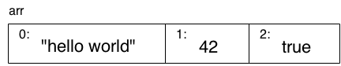

# You Don't Know JS: Up & Going
# Capítulo 2: Hacia JavaScript

En el capítulo anterior, introduje los componentes básicos de la programación, tales como variables, bucles, condicionales y funciones. Por supuesto, todo el código mostrado ha sido en JavaScript. Pero en este capítulo, queremos centrarnos específicamente en las cosas que necesita saber sobre JavaScript para comenzar a trabajar como desarrollador de JS.

En este capítulo presentaremos algunos conceptos que no se explorarán completamente hasta los siguientes libros * YDKJS *. Puede considerar este capítulo como una visión general de los temas tratados en detalle a lo largo del resto de esta serie.

Especialmente si eres nuevo en JavaScript, deberías pasar bastante tiempo revisando los conceptos y ejemplos de código aquí varias veces. Cualquier buena base se coloca ladrillo a ladrillo, así que no espere que lo comprenda de inmediato todo en el primer paso.

Su viaje para aprender profundamente JavaScript comienza aquí.

**Nota:** Como dije en el capítulo 1, definitivamente debes probar todo este código mientras lees y trabajas en este capítulo. Tenga en cuenta que parte del código aquí asume las capacidades introducidas en la versión más reciente de JavaScript en el momento de escribir este artículo (comúnmente denominado "ES6" para la 6ª edición de ECMAScript -- el nombre oficial de la especificación JS). Si está utilizando un navegador anterior, pre-ES6, es posible que el código no funcione. Se debe utilizar una actualización reciente de un navegador moderno (como Chrome, Firefox o IE).

## Valores & Typos

Como afirmamos en el capítulo 1, JavaScript tien valores tipados, no variables tipadas. Están incorporados y disponibles los siguientes tipos:

* `string`
* `number`
* `boolean`
* `null` y `undefined`
* `object`
* `symbol` (nuevo en ES6)

JavaScript proporciona un operador `typeof` que puede examinar un valor y decirle qué tipo es:

```js
var a;
typeof a;				// "undefined"

a = "hello world";
typeof a;				// "string"

a = 42;
typeof a;				// "number"

a = true;
typeof a;				// "boolean"

a = null;
typeof a;				// "object" -- weird, bug

a = undefined;
typeof a;				// "undefined"

a = { b: "c" };
typeof a;				// "object"
```

El operador `typeof` siempre retorna uno de seis tipos (siete a partir de ES6! - el tipo "symbol")  como un valor de tipo `string`. Es decir, `typeof "abc"` devuelve `"string"`, no `string`.

Observe cómo en este fragmento la variable `a` contiene cada tipo diferente de valor, y que a pesar de las apariencias, `typeof a` no solicita el "tipo de `a` ", sino el tipo del valor actualmente en `a`." Sólo los valores tienen tipos en JavaScript; Las variables son simples contenedores para esos valores.

`typeof null` es un caso interesante, porque devuelve unusualmente `"object"`, cuando esperaría que devolviese `"null"`.

**Advertencia:** Este es un error prolongado a largo tiempo en JS, pero es probable que nunca se solucione. ¡Demasiado código en la Web se basa en el error y, por lo tanto, solucionarlo causaría muchos más errores!

Además, tenga en cuenta `a = undefined`. Estamos estableciendleo explícitamente `a` el valor `undefined`, pero  ese comportamiento no es diferente del de una variable que aún no tiene un valor establecido, como con la línea `var a;` en la parte superior del fragmento de código. Una variable puede llegar a este estado de valor "indefinido" de varias maneras diferentes, incluidas las funciones que no devuelven valores y el uso del operador `void`.

### Objetos

El tipo `object` se refiere a un valor compuesto en el que pueden establecer propiedades (llámese ubicaciones) en las que cada una contenga sus propios valores de cualquier tipo. Este es quizás uno de los tipos de valor más útiles en todo JavaScript.

```js
var obj = {
	a: "hello world",
	b: 42,
	c: true
};

obj.a;		// "hello world"
obj.b;		// 42
obj.c;		// true

obj["a"];	// "hello world"
obj["b"];	// 42
obj["c"];	// true
```

It may be helpful to think of this `obj` value visually:


Se puede acceder a las propiedades con la *dot notation* (notación con punto, es decir `obj.a`) o *bracket notation* (notación de corchetes, es decir `obj["a"]`). La notación con punto es más corta y normalmente más fácil de leer, y por lo tanto se prefiere cuando es posible.

La notación de corchetes es útil si tiene un nombre de propiedad que tiene caracteres especiales, como `obj["hello world!"]` -- estas propiedades a menudo se denominan *keys* (claves) cuando se accede a ellas mediante notación de corchetes. La notación `[]` requiere una variable (explicada a continuación) o un `string` *literal* (que debe estar entrecomillada entre `".."` o `'..'`).

Por supuesto, la notación de corchetes también es útil si desea acceder a una propiedad/clave pero el nombre se almacena en otra variable, como:

```js
var obj = {
	a: "hello world",
	b: 42
};

var b = "a";

obj[b];			// "hello world"
obj["b"];		// 42
```

**Nota:** Para obtener más información sobre los `objetos` de JavaScript, consulte el título *this & Object Prototypes* de esta serie, específicamente el capítulo 3.

Hay un par de otros tipos de valores con los que comúnmente interactuarás en los programas de JavaScript: *array* y *function*. Pero en lugar de ser tipos incorporados adecuados, se debe pensar en subtipos, versiones especializadas del tipo `object`.

#### Arrays

Un array (matriz) es un `object` que contiene valores (de cualquier tipo) no particularmente en properties/keys con nombre, sino en posiciones indexadas numéricamente. Por ejemplo:

```js
var arr = [
	"hello world",
	42,
	true
];

arr[0];			// "hello world"
arr[1];			// 42
arr[2];			// true
arr.length;		// 3

typeof arr;		// "object"
```

**Nota:** Los lenguajes que comienzan a contar desde cero, como JS, utilian `0` como el índice del primer elemento del array.

Puede ser útil pensar en `arr` visualmente:



Debido a que los  arrays son objetos especiales (como indica `typeof`),también pueden tener propiedades, incluida la propiedad `length` que se actualiza automáticamente.

Teóricamente, podría usar un `array` como un `object` normal con sus propias propiedades nombradas, o podría usar un `object` pero solo asignarle propiedades numéricas (`0`, `1`, etc.) similares a un `array`. Sin embargo, esto generalmente se consideraría uso inadecuado de los respectivos tipos.

El mejor y más natural enfoque es usar `array`s para valores posicionados numéricamente y usar `object`s para propiedades nombradas.

#### Funiones

El otro subtipo `objeto` que usarás en todos tus programas JS es una función:

```js
function foo() {
	return 42;
}

foo.bar = "hello world";

typeof foo;			// "function"
typeof foo();		// "number"
typeof foo.bar;		// "string"
```

De nuevo, las funciones son un subtipo de `object` --` typeof` devuelve `"function"`, lo que implica que una función es un tipo principal -- y, por tanto, puede tener propiedades, pero normalmente solo usará las propiedades del objeto función (como `foo.bar`) en casos limitados.

** Nota: ** Para obtener más información sobre los valores de JS y sus tipos, consulte los dos primeros capítulos del título *Types & Grammar* de esta serie.

### Métodos de tipos incorporados

Los tipos y subtipos integrados que acabamos de discutir tienen comportamientos expuestos como propiedades y métodos que son bastante poderosos y útiles.

Por ejemplo:

```js
var a = "hello world";
var b = 3.14159;

a.length;				// 11
a.toUpperCase();		// "HELLO WORLD"
b.toFixed(4);			// "3.1416"
```

El "cómo" detrás de poder llamar a `a.toUpperCase()` es más complejo que solo ese método existe en el valor.

Brevemente, hay una forma de objeto envoltorio `String` (con `S` mayúscula), normalmente llamada "nativa", en la que se empareja con el tipo primitivo `string`; es este contenedor de objetos el que define el método `toUpperCase()` en su prototipo.

Cuando se utiliza un valor primitivo como "hello world" como un objeto haciendo referencia a una propiedad o método (como `a.toUpperCase()` en el ejemplo), JS automaticamnete "encaja" el valor a su objeto envoltorio homólogo (oculto bajo el telón).

Un valor `string`puede ser envuelto por un objeto `String`, un `number` por un `Number` y un `boolean` por un `Boolean`. En la mayoría de los casos, no necesita preocuparse o utilizar directamente estas formas de objetos envoltorio de los valores -- prefiera el valor en su forma primitiva en prácticamente todos los casos y JavaScript se ocupará del resto por usted.

**Nota:** Para más información sobre las fomas nativas y el "boxing" (encaje), vea el capítulo 3 del título *Types & Grammar*. Para entender el prototipo de un objeto, vea el capítulo 5 del título *this & Object Prototypes* de esta serie.

### Comparación de valores

Hay dos maneras principales de de comparación de valores que necesitará hacer en sus programas JS: *igaldad* y *desigualdad*. El resultad de cualquier comparaión es un valor estrictamente `boolean` (`true` o `false`), independientemente de los tipos que se comparan.

#### Forzado de tipos / Coercion

Hablamos brevemente sober el *forzado de tipos* o *coerción* en el capítulo 1, pero revisémoslo aquí.

Hay dos tipos de *coercion* en JavaScript: *explícito* e *implícito*. La coerción explícita es la que puede ver en el código, que producirá una conversión de un tipo a otro, mientras que la coerción implícita es cuando la conversión de tipo puede ocurrir como un efecto secundario no obvio o de manera visible de alguna otra operación.

Probablemente haya escuchado sentimientos como "la coerción es malvada" debido al hecho de que claramente hay lugares donde la coerción puede producir algunos resultados inesperados. Quizás nada evoca más frustración de los desarrolladores que cuando el lenguaje los sorprende.

La coerción no es mala, ni tiene que ser sorprendente. De hecho, la mayoría de los casos que puede construir con forzado de tipo son bastante razonables y comprensibles, e incluso pueden usarse para *mejorar* la legibilidad de su código. Pero no profundizaremos en ese debate: el capítulo 4 del título *Types & Grammar* de esta serie abarca todos los enfoques.

Aquí hay un ejemplo de coerción *explícita*:

```js
var a = "42";

var b = Number(a);

a;				// "42"
b;				// 42 -- the number!
```

Y aquí hay un ejemplo de coerción *implícita*:

```js
var a = "42";

var b = a * 1;	// "42" implicitly coerced to 42 here

a;				// "42"
b;				// 42 -- the number!
```

#### Truthy & Falsy


En el capítulo 1, mencionamos brevemente la naturaleza "truthy" y "falsy" de los valores: cuando un valor no-`boolean` es forzado a `boolean`, ¿se convierte en `true` or `false`, respectivamente?

La lista específica de valores "falsy" en JavaScript es la siguiente:

* `""` (empty string)
* `0`, `-0`, `NaN` (invalid `number`)
* `null`, `undefined`
* `false`

Cualquier valor que no esté en esta lista de "falsy" es "truthy." He aquí algunos ejemplos:

* `"hello"`
* `42`
* `true`
* `[ ]`, `[ 1, "2", 3 ]` (arrays)
* `{ }`, `{ a: 42 }` (objects)
* `function foo() { .. }` (functions)

Es importante recordar que un valor no-`boolean` solo sigue esta coerción "truthy"/"falsy" si realmente se le fuerza a `boolean`. No es tan difícil confundirse con una situación
 que parece que está forzando un valor a un 'booleano' cuando no lo es.

#### Igualdad

Hay cuatro operadores de igualdad: `==`, `===`, `!=`, y `!==`. Las formas `!` son, por supuesto, las versiones simétricas "no iguales" de sus contrapartes; *no-igualdad* no debe confundirse con *desigualdad*.

La diferencia entre `==` y `===` se caracteríza normalmente porque `==` comprueba la igualdad de los valores y `===` comprueba que ambos valores son del mismo tipo y tienen el mismo valor. Sin embargo, esto es inexacto. La forma correcta de interpretarlos es que `==` comprueba la igualdad permitiendo la coerción, y `===` comprueba la igualdad sin permitir la coerción; a menudo se conoce como "igualdad estricta"  por este motivo.

Considerando la coerción implícita que está permitida por la comparación de igualdad `==` y no permitida con la igualdad estricta `===`:

```js
var a = "42";
var b = 42;

a == b;			// true
a === b;		// false
```

En la comparación `a == b`, JS se da cuenta de que los tipos no coinciden, por lo que pasa por una serie ordenada de pasos para forzar uno o ambos valores a un tipo diferente hasta que los tipos coincidan, en la que puede comprobar una simple igualdad de valores.

Si lo piensa bien, hay dos formas posibles por las que `a == b` podría dar` true` a través de la coerción. O la comparación podría terminar como `42 == 42` o podría ser `"42" == "42"`. Entonces, ¿cuál sería?

La respuesta: `"42"` se convierte en `42`, para hacer la comparación `42 == 42`. En un ejemplo tan simple, realmente no parece importar en qué sentido va ese proceso, ya que el resultado final es el mismo. Hay casos más complejos en los que importa no solo cuál es el resultado final de la comparación, sino también *cómo* se obtiene.

La `a === b` produce `false`, porque la coerción no está permitida, por lo que la simple comparación de valores falla obviamente. Muchos desarrolladores creen que `===` es más predecible, por lo que abogan por usar siempre ese formato y mantenerse alejados de `==`. Creo que esta vista es muy corta de miras. Creo que `==` es una herramienta poderosa que ayuda a su programa, *si se toma el tiempo para aprender cómo funciona*.

No vamos a cubrir todos los detalles esenciales de cómo funciona la coerción en las comparaciones `==` aquí. Gran parte de esto es bastante sensible, pero hay algunos casos importantes a tener en cuenta. Puede leer la sección 11.9.3 de la especificación ES5 (http://www.ecma-international.org/ecma-262/5.1/) para ver las reglas exactas, y se sorprenderá de lo sencillo que es este mecanismo, en comparación con todas las exageraciones negativas que lo rodean.

Para resumir una gran cantidad de detalles a unos pocos comentarios simples, y ayudarlo a saber si debe usar `==` o `===` en varias situaciones, estas son mis reglas simples:

* Si cualquera de los valores (o lados) en la comparación podría ser el valor `true` or `false`, evite `==` u use `===`
* Si cualquiera de los valores en una comparación podría ser uno de estos valores específicos (`0`, `""`, o `[]`-- array vacío), evite` == `y use` === `.
* En *todos* los demás casos, es seguro usar `==`. No solo es seguro, sino que en muchos casos simplifica su código de una manera que mejora la legibilidad.

A lo que se reducen estas reglas es a que es necesario que piense críticamente sobre su código y sobre qué tipo de valores pueden venir a través de las variables que se comparan en la igualdad. Si puede estar seguro de los valores, y `==` es seguro, ¡úselo! Si no puede estar seguro de los valores, use `===`. Es así de simple.

De forma simétrica, la no-igualdad `!=` forma pareja con `==`, y la forma `!==` con `===`. Todas las reglas y observaciones que acabamos de discutir son simétricas para estas comparaciones de no igualdad.

Debería tomar nota especial de las reglas de comparación `==` y `===` si estás comparando dos valores no primitivos, como `object`s (incluyendo` function` y `array`). Debido a que esos valores se mantienen en realidad por referencia, las comparaciones `==` y `===` simplemente verificarán si las referencias coinciden, nada sobre los valores subyacentes.

Por ejemplo, por defecto, los `array`s son coercionados a `string`s simplemente uniendo todos los valores con comas (`,`) entre ellos. Podría pensar que dos `array`s con el mismo contenido serían iguales `==`, pero no lo son:

```js
var a = [1,2,3];
var b = [1,2,3];
var c = "1,2,3";

a == c;		// true
b == c;		// true
a == b;		// false
```

**Nota:** Para obtener más información sobre las reglas de comparación de igualdad `==`, consulte la especificación ES5 (sección 11.9.3) y consulte también el capítulo 4 del título *Types & Grammar* de esta serie; consulte el capítulo 2 para obtener más información sobre valores versus referencias.

#### Desigualdad

Los operadores `<`, `>`, `<=`, y `>=` se utilizan para la desigualdad, referido en la especificación como "comparación relacional." Normalmente se utilizan con valores ordinarios comparables como `number`s. Es fácil entender que `3 < 4`.

Pero los valores `string` en JavaScript también pueden ser comparados por desigualdad, utilizando las reglas alfabéticas típicas (`"bar" < "foo"`).

¿Qué pasa con la coerción? Reglas similares a la comparación `==` (¡aunque no exactamente idénticas!) Se aplican a los operadores de desigualdad. En particular, no hay operadores de "desigualdad estricta" que rechacen la coacción de la misma manera que lo hace `===` "igualdad estricta".

Considerando:

```js
var a = 41;
var b = "42";
var c = "43";

a < b;		// true
b < c;		// true
```

¿Qué pasa aquí? En la sección 11.8.5 de la especificación ES5, dice que si ambos valores en la comparación `<` son `string`s, como ocurre con `b < c`, la comparación se realiza de forma lexicográfica (también conocida alfabéticamente como en un diccionario). Pero si uno o ambos no son un `string`, como sucede con `a < b`, ambos valores se convierten en `number` y se produce una comparación numérica típica.

El mayor problema que puede encontrar aquí con comparaciones entre tipos de valores potencialmente diferentes (recuerde, no hay formas de "desigualdad estricta" para usar) es cuando uno de los valores no se puede convertir en un número válido, como:

```js
var a = 42;
var b = "foo";

a < b;		// false
a > b;		// false
a == b;		// false
```

Espera, ¿cómo pueden las tres de esas comparaciones ser `false`? Debido a que el valor `b` se está forzando al "valor numérico no válido" `NaN` en las comparaciones `<` y `>`, y la especificación dice que `NaN` no es mayor ni menor que cualquier otro valor .

La comparación `==` falla por una razón diferente. `a == b` podría fallar si se interpreta como `42 == NaN` o `"42"== "foo"` -- como explicamos anteriormente, el primero es el caso.

**Nota:** Para obtener más información sobre las reglas de comparación de desigualdad, consulte la sección 11.8.5 de la especificación ES5 y también consulte el capítulo 4 del título *Types & Grammar* de esta serie.

## Variables

En JavaScript, los nombres de variables (incluidos los nombres de funciones) deben ser *identificadores* válidos. Las reglas estrictas y completas para los caracteres válidos en los identificadores son un poco complejas cuando se consideran caracteres no tradicionales, como Unicode. Sin embargo, si solo considera los caracteres alfanuméricos ASCII típicos, las reglas son simples.

Un identificador debe comenzar con `a`-`z`,` A`-`Z`, `$` o `_`. Entonces puede contener cualquiera de esos caracteres más los números `0`-`9`.

En general, se aplican las mismas reglas a un nombre de propiedad como a un identificador de variable. Sin embargo, ciertas palabras no pueden usarse como variables, pero están bien como nombres de propiedades. Estas palabras se denominan "palabras reservadas" e incluyen las palabras clave JS (`for`,` in`, `if`, etc.) así como` null`, `true` y` false`.

**Nota:** Para obtener más información sobre las palabras reservadas, consulte el Apéndice A del título *Types & Grammar* de esta serie.

### Scopes de funciones

Utilice la palabra clave `var` para declarar una variable que pertenecerá al `scope` de la función actual, o el `scope` global si está en el nivel superior, fuera de cualquier función.

#### Elevación / Hoisting

Donde quiera que aparezca un `var` dentro de un scope, se considera que esa declaración pertenece a todo el scope y es accesible en todas partes.

Metafóricamente, este comportamiento se denomina *hoisting*, cuando una declaración `var` se "mueve" conceptualmente a la parte superior del su scope de inclusión. Técnicamente, este proceso se explica con mayor precisión por la forma en que se compila el código, pero por ahora podemos omitir esos detalles.

Considerando:

```js
var a = 2;

foo();					// works because `foo()`
						// declaration is "hoisted"

function foo() {
	a = 3;

	console.log( a );	// 3

	var a;				// declaration is "hoisted"
						// to the top of `foo()`
}

console.log( a );	// 2
```

**Advertencia:** No es común o buena idea confiar en *hoisting* para utilizar una variable en su scope antes de que aparezca su declaración `var`; puede ser bastante confuso. Es mucho más común y aceptado el uso de declaraciones de función *hoisted*, como hacemos con la llamada `foo ()` que aparece antes de su declaración formal.

#### Ámbitos anidados / Nested Scopes

Cuando declara una variable, estará disponible en cualquier parte de ese scope, así como en cualquier ámbito inferior/interno. Por ejemplo:

```js
function foo() {
	var a = 1;

	function bar() {
		var b = 2;

		function baz() {
			var c = 3;

			console.log( a, b, c );	// 1 2 3
		}

		baz();
		console.log( a, b );		// 1 2
	}

	bar();
	console.log( a );				// 1
}

foo();
```

Observe que `c` no está disponible dentro de `bar()`, porque se declara solo dentro del scope interno `baz()`,  y que `b` no está disponible para `foo()` por la misma razón.

Si intenta acceder al valor de una variable en un ámbito donde no está disponible, obtendrás un `ReferenceError`arrojado. Si intenta establecer una variable que no se ha declarado, terminará creando una variable en el ámbito global de nivel superior (¡malo!) O recibirá un error, según el "strict mode" (consulte "Strict Mode"). Vamos a ver:

```js
function foo() {
	a = 1;	// `a` not formally declared
}

foo();
a;			// 1 -- oops, auto global variable :(
```

Esta es una muy mala práctica. ¡No lo hagaa! Siempre declare sus variables formalmente.

Además de crear declaraciones para variables a nivel de función, ES6 le *permite* declarar variables que pertenecen a bloques individuales (pares de `{ .. }`), usando la palabra clave `let`. Además de algunos detalles matizados, las reglas de alcance se comportarán aproximadamente de la misma forma que vimos con las funciones:

```js
function foo() {
	var a = 1;

	if (a >= 1) {
		let b = 2;

		while (b < 5) {
			let c = b * 2;
			b++;

			console.log( a + c );
		}
	}
}

foo();
// 5 7 9
```

Debido a que se usa `let` en lugar de `var`, `b` pertenecerá solo a la declaración `if` y, por tanto, no al alcance completo de la función `foo ()`. De manera similar, `c` pertenece solo al bucle `while`. El alcance del bloque es muy útil para administrar el scope de sus variables de una manera más precisa, lo que puede hacer que su código sea mucho más fácil de mantener en el tiempo.

**Nota:** Para obtener más información sobre el alcance, consulte el título *Scope & Closures* de esta serie. Consulte el título *ES6 & Beyond* de esta serie para obtener más información sobre el alcance del bloque `let`.

## Condicionales

Además de la instrucción `if` que introdujimos brevemente en el capítulo 1, JavaScript proporciona algunos otros mecanismos condicionales que debemos analizar.

A veces, puede que se encuentre escribiendo una serie de afirmaciones `if..else..if` como esta:

```js
if (a == 2) {
	// do something
}
else if (a == 10) {
	// do another thing
}
else if (a == 42) {
	// do yet another thing
}
else {
	// fallback to here
}
```

Esta estructura funciona, pero es un poco *verbosa* porque necesita especificar la comprobación de `a` para cada caso. Aquí hay otra opción, la declaración `switch`:

```js
switch (a) {
	case 2:
		// do something
		break;
	case 10:
		// do another thing
		break;
	case 42:
		// do yet another thing
		break;
	default:
		// fallback to here
}
```

El `break` es importante si desea que solo se ejecuten las declaraciones en un `case` (caso). Si omite `break` de un `case`, y ese `case` coincide o se ejecuta, la ejecución continuará con las siguientes afirmaciones de `case` independientemente de la coincidencia de ese `case`. Este efecto llamado "caída" es a veces útil/deseado:

```js
switch (a) {
	case 2:
	case 10:
		// some cool stuff
		break;
	case 42:
		// other stuff
		break;
	default:
		// fallback
}
```

Aquí, si `a` es` 2` o `10`, ejecutará las instrucciones de código de "some cool stuff".

Otra forma de condicional en JavaScript es el "operador condicional", a menudo llamado "operador ternario". Es como una forma más concisa en una sola instrucción `if..else`, como:

```js
var a = 42;

var b = (a > 41) ? "hello" : "world";

// similar to:

// if (a > 41) {
//    b = "hello";
// }
// else {
//    b = "world";
// }
```

Si la condición (aquí `a > 41`) es evaluada como `true`, devuelve la primera clausua (`"hello"`), de lo contrario se devuleve la segunda clausula (`"world"`),  y sea cual sea el resultado se asigna a `b`.

El operador condicional no tiene que ser usado en una asignación, pero ese es sin duda el uso más común.

**Nota:** Para obtener más información sobre las condiciones de prueba y otros patrones para `switch` y `? :`, vea el título *Types & Grammar* de esta serie.

## Strict Mode

ES5 agregó un "strict mode" (modo estricto) al lenguaje,que refuerza las reglas para ciertos comportamientos. En general, se considera que estas restricciones mantienen el código en un conjunto de pautas más seguro y apropiado. Además, seguir el modo estricto hace que su código sea más optimizable por el motor. El modo estricto es una gran ganancia para el código, y debería usarlo en todos sus programas.

Puede optar por el modo estricto para una función individual o un archivo completo, dependiendo de dónde coloque el modo estricto pragma:

```js
function foo() {
	"use strict";

	// this code is strict mode

	function bar() {
		// this code is strict mode
	}
}

// this code is not strict mode
```

Compare esto con:

```js
"use strict";

function foo() {
	// this code is strict mode

	function bar() {
		// this code is strict mode
	}
}

// this code is strict mode
```

Una diferencia clave (¡mejora!) con el modo estricto es no permitir que la declaración implícita de la variable auto-global omita el `var`:

```js
function foo() {
	"use strict";	// turn on strict mode
	a = 1;			// `var` missing, ReferenceError
}

foo();
```

Si activa el modo estricto en su código y surgen errores, o el código comienza a comportarse con errores, su tentación podría ser evitar el modo estricto. Pero ese instinto sería una mala idea. Si el modo estricto causa problemas en su programa, es casi seguro que es una señal de que tiene cosas en su programa que debe corregir.

El modo estricto no solo mantendrá su código en un camino más seguro, y no solo hará sea más optimizable, sino que también representa la dirección futura del lenguaje. Sería más fácil acostumbrarse al modo estricto ahora que seguir postergándolo; ¡solo será más difícil convertirlo más tarde!

**Nota:** Para obtener más información sobre el modo estricto, consulte el capítulo 5 del título *Types & Grammar* de esta serie.

## Funciones Como Valores

Hasta ahora, hemos analizado las funciones como el mecanismo principal de *alcance* en JavaScript. Recuerde que la sintaxis típica de la declaración de `function` es de la siguiente manera:

```js
function foo() {
	// ..
}
```

Aunque puede no parecer obvio a partir de esa sintaxis, `foo` es básicamente una variable en el *scope* que la envuelve, a la que se le da una referencia a la `function` que se está declarando. Es decir, la `función` en sí misma es un valor, tal como lo sería `42` o `[1,2,3]`.

Esto puede parecer un concepto extraño al principio, así que tómate un momento para reflexionar sobre ello. No solo puede pasar un valor (argumento) *a* una función, sino que *una función en sí misma puede ser un valor* que se asigna a las variables, o que se pasa o retorna desde otras funciones.

Como tal, el valor de una función debe considerarse como una expresión, al igual que cualquier otro valor o expresión.

Considerando:

```js
var foo = function() {
	// ..
};

var x = function bar(){
	// ..
};
```

La primera expresión de función asignada a la variable `foo` se llama *anónima* porque no tiene `nombre`.

La segunda expresión de la función es *nombrada* (`bar`), incluso como una referencia a ella también se asigna a la variable `x`. *Las expresiones de funciones nombradas* son generalmente más preferibles, aunque *las expresiones de funciones anónimas* todavía son extremadamente comunes.

Para obtener más información, consulte el título *Scope & Closures* de esta serie.

### Expresiones de función invocadas de inmediato / Immediately Invoked Function Expressions (IIFEs)

En el fragmento anterior, ninguna de las expresiones de función se ejecuta -- podríamos si hubiéramos incluido `foo()` o `x()`, por ejemplo.

Hay otra forma de ejecutar una expresión de función, que normalmente se denomina como una *expresión de función invocada de inmediato* o *autoinvocadas* (*immediately invoked function expression* -- IIFE):

```js
(function IIFE(){
	console.log( "Hello!" );
})();
// "Hello!"
```

Los `(..)`, paréntesis externos que rodean la expresión de la función `(function IIFE(){ .. })` son solo un matiz de la gramática JS necesaria para evitar que se la trate como una declaración de función normal.

Los últimos paréntesis de la expresión `()` -- la línea `})();` -- es lo que ejecuta realmente la  función a la que se hace referencía justo antes.

Esto puede parecer extraño, pero no lo es tanto como a primera vista. Considera las similitudes entre `foo` y` IIFE` aquí:

```js
function foo() { .. }

// `foo` function reference expression,
// then `()` executes it
foo();

// `IIFE` function expression,
// then `()` executes it
(function IIFE(){ .. })();
```

Como puede ver, escribir `(function IIFE(){ .. })` antes de que se ejecute con `()`, es esencialmente lo mismo que incluir `foo` antes de ejecutar con `()`; en ambos casos, la función a la que hacen referencia es ejecutada con `()` inmediatamente después.

Debido a que un IIFE es solo una función, y las funciones crean un *scope* de la variable, utilizar un IIFE de esta manera, a menudo se usa para declarar variables que no afectarán el código circundante fuera del IIFE:

```js
var a = 42;

(function IIFE(){
	var a = 10;
	console.log( a );	// 10
})();

console.log( a );		// 42
```

Las IIFEs también puede devolver valores:

```js
var x = (function IIFE(){
	return 42;
})();

x;	// 42
```

El valor `42` se obtine como resultado (`return`) de la ejecución de la función llamada `IIFE`, y es asignada a `x`.

### Closure

*Closure* es uno de los conceptos más importantes, y a menudo menos entendidos, en JavaScript. No lo cubriré en detalle aquí, en cambio, lo referiré al título *Scope & Closures* de esta serie. Pero quiero decir algunas cosas al respecto para que entienda el concepto general. Será una de las técnicas más importantes en su conjunto de habilidades de JS.

Puede pensar en el *closure* (cierre) como una forma de "recordar" y continuar accediendo al alcance de una función (sus variables) incluso una vez que la función haya terminado de ejecutarse.

Considerando:

```js
function makeAdder(x) {
	// parameter `x` is an inner variable

	// inner function `add()` uses `x`, so
	// it has a "closure" over it
	function add(y) {
		return y + x;
	};

	return add;
}
```

La referencia a la función interna `add(..)` que se devuelve con cada llamada externa al `makeAdder(..)` es capaz de recordar cualquier valor de `x` que se haya pasado a `makeAdder (..)`.

Ahora, usemos `makeAdder (..)`:


```js
// `plusOne` gets a reference to the inner `add(..)`
// function with closure over the `x` parameter of
// the outer `makeAdder(..)`
var plusOne = makeAdder( 1 );

// `plusTen` gets a reference to the inner `add(..)`
// function with closure over the `x` parameter of
// the outer `makeAdder(..)`
var plusTen = makeAdder( 10 );

plusOne( 3 );		// 4  <-- 1 + 3
plusOne( 41 );		// 42 <-- 1 + 41

plusTen( 13 );		// 23 <-- 10 + 13
```

Más sobre cómo funciona este código:

1. Cuando llamamos a `makeAdder(1)`, obtenemos una referencia a la función interna `add(..)` que recuerda `x` como `1`. Llamamos a esta referencia de la función `plusOne(..)`.
2. Cuando llamamos a `makeAdder(10)`, obtenemos otra referencia a la función interna `add(..)` que recuerda `x` como `10`. Llamamos a esta referencia de la función `plusTen(..)`.
3. Cuando llamamos a `plusOne(3)`, suma `3` (su `y` interna) al `1` (recordado por `x`), y obtenemos como resultado `4`.
4. Cuando llamamos a `plusTen(13)`, suma `13` (su `y` interna) al `10` (recordado por `x`), y obtenemos como resultado `23`.

No se preocupe si esto le parece extraño y confuso al principio -- ¡puede ser! Tomará mucha práctica entenderlo completamente.

Pero confíe en mí, una vez que lo haga, es una de las técnicas más poderosas y útiles de toda la programación. Definitivamente vale la pena el esfuerzo de dejar que tu cerebro hierva a fuego lento por un momento. En la siguiente sección, tendremos un poco más de práctica con *closure*.

#### Módulos / Modules

El uso más común de los *closures* en JavaScript es el patrón módulo. Los módulos le permiten definir detalles de implementación privada (variables, funciones) que están ocultos al mundo exterior, así como una API pública que *es* accesible desde el exterior.

Considerando:

```js
function User(){
	var username, password;

	function doLogin(user,pw) {
		username = user;
		password = pw;

		// do the rest of the login work
	}

	var publicAPI = {
		login: doLogin
	};

	return publicAPI;
}

// create a `User` module instance
var fred = User();

fred.login( "fred", "12Battery34!" );
```

La función `User()` sirve como un scope que contiene las variables `username` y `password`, así como la función interna `doLogin()`; Todos estos son detalles internos privados de este módulo `User` al que no se puede acceder desde el mundo exterior.

**Advertencia:** Aquí no estamos llamando `new User()` a proposito, a pesar del hecho de que probablemente parecería lo más común para la mayoría de los lectores. `User()` es solo una función, no una clase para ser instanciada, por lo que simplemente hacemos una llamada normal. Utilizar `new` sería inapropiado y en realidad desperdiciariamos recursos.

La ejecución de `User()` (observese el uso de los paréntesis) crea una *instancia * del módulo `User` -- se crea un scope totalmente nuevo, y por lo tanto se crea una copia completamente nueva de cada una de estas variables. Asignamos esta instancia a `fred`. Si ejecutamos `User ()` de nuevo, obtendríamos una nueva instancia completamente separada de `fred`.

La función interna `doLogin ()` tiene un *closure* sobre `username` y` password`, lo que significa que mantendrá su acceso a ellos incluso después de que la función `User()` termine de ejecutarse.

`publicAPI` es un objeto con una propiedad/método en él, `login`, que es una referencia a la función interna `doLogin()`. Cuando devolvemos `publicAPI` de` User()`, se convierte en la instancia que llamamos` fred`.

En este punto, la función externa `User()` ha terminado de ejecutarse. Normalmente, pensaría que las variables internas como `username` y` password` han desaparecido. Pero aquí no lo han hecho, porque hay un *closure* en la función `login()` que los mantiene con vida.

Es por eso que podemos llamar a `fred.login(..)` -- lo mismo que llamar al `doLogin(..)` interno -- y todavía puede acceder a las variables internas `username` y` password`.

Es bastante probable de que solo con este breve vistazo al closure y el patrón del módulo, parte de él sea todavía un poco confuso. ¡Está bien! Se necesita algo de trabajo para hacerse una idea.

Desde aquí, lea el título *Scope & Closures* e esta serie para una exploración mucho más profunda.

## Identficador `this`

Otro concepto muy mal entendido en JavaScript es el identificador `this`. Una vez más, hay un par de capítulos sobre esto en el título *this & Object Prototypes* de esta serie, por lo que aquí haremos una breve introducción del concepto.

Si bien a menudo puede parecer que `this` está relacionado con "patrones orientados a objetos", en JS `this` es un mecanismo diferente.

Si una función tiene una referencia `this` dentro de ella, esa referencia normalmente apunta a un `objeto`. Pero a qué `object` apunta depende de cómo se llamó la función.

Es importante darse cuenta de que `this` *no* se refiere a la función en sí, ya que es el error más común.

Aquí hay una rápida ilustración:

```js
function foo() {
	console.log( this.bar );
}

var bar = "global";

var obj1 = {
	bar: "obj1",
	foo: foo
};

var obj2 = {
	bar: "obj2"
};

// --------

foo();				// "global"
obj1.foo();			// "obj1"
foo.call( obj2 );		// "obj2"
new foo();			// undefined
```

Hay cuatro reglas sobre cómo se establece `this`, y se muestran en esas últimas cuatro líneas de ese fragmento.

1. `foo()` termina configurando `this` en el objeto global en modo no estricto -- en modo estricto,`this` sería `undefined` y obtendrías un error al acceder a la propiedad `bar` -- por lo que `"global"` es el valor encontrado para `this.bar`.
2. `obj1.foo ()` establece `this` en el objeto` obj1`.
3. `foo.call (obj2)` establece `this` en el objeto` obj2`.
4. `new foo()` establece `this` en un nuevo objeto vacío.

Conclusión: para comprender a qué apunta `this`, debe examinar cómo se llamó a la función en cuestión. Será una de esas cuatro formas que acabo de mostrar, y así podrá responder  qué es `this`.

**Nota:** Para obtener más información sobre `this`, consulte los capítulos 1 y 2 del titulo *this & Object Prototypes* de esta serie.

## Prototipos / Prototypes

El mecanismo prototipo en JavaScript es bastante complicado. Solo lo echaremos un vistazo aquí. Querrá pasar mucho tiempo revisando los capítulos 4-6 del título *this & Object Prototypes* de esta serie para obtener todos los detalles.

Cuando hace referencia a una propiedad en un objeto, si esa propiedad no existe, JavaScript usará automáticamente la referencia interna del prototipo de ese objeto para encontrar otro objeto para buscar la propiedad. Se podría pensar en esto casi como una alternativa si falta la propiedad.

El enlace de referencia del prototipo interno de un objeto a su alternativa ocurre en el momento en que se crea el objeto. La forma más sencilla de ilustrarlo es con una utilidad incorporada llamada `Object.create(..)`.

Considerando:

```js
var foo = {
	a: 42
};

// create `bar` and link it to `foo`
var bar = Object.create( foo );

bar.b = "hello world";

bar.b;		// "hello world"
bar.a;		// 42 <-- delegated to `foo`
```

Puede ayudar a visualizar los objetos `foo` y` bar` y su relación:


La propiedad `a` en realidad no existe en el objeto `bar`, pero debido a que `bar` está vinculada a `foo` como prototipo, JavaScript automáticamente vuelve a buscar `a` en el objeto` foo`, donde pudo encontrarlo.

Este vínculo puede parecer una característica extraña del lenguaje. La forma más común en que se usa esta característica, y yo diría que abusada, es tratar de emular/falsificar un mecanismo de "clase" con "herencia".

Pero una forma más natural de aplicar prototipos es un patrón llamado "delegación de comportamiento", en el que intencionalmente diseñas tus objetos vinculados para poder *delegar* de uno a otro para partes del comportamiento necesario.

**Nota:** Para obtener más información sobre los prototipos y la delegación de comportamiento, consulte los capítulos 4-6 del título *this & Object Prototypes* de esta serie.

## Viejo & Nuevo

Algunas de las características de JS que ya hemos cubierto, y ciertamente muchas de las características que se tratan en el resto de esta serie, son adiciones más recientes y no necesariamente estarán disponibles en los navegadores más antiguos. De hecho, algunas de las características más nuevas de la especificación aún no están implementadas en ningún navegador estable.

Entonces, ¿qué hacer con las cosas nuevas? ¿Solo tiene que esperar durante años o décadas para que todos los navegadores antiguos se desvanezcan en la oscuridad?

Así es como mucha gente piensa acerca de la situación, pero realmente no es un enfoque saludable para JS.

Hay dos técnicas principales que puede usar para "traer" lo más nuevo de JavaScript a los navegadores más antiguos: *polyfilling* y  *transpiling*.

### Polyfilling

La palabra "polyfill" es un término inventado (por Remy Sharp) (https://remysharp.com/2010/10/08/what-is-a-polyfill) usado para referirse a tomar la definición de una característica más nueva y producir un fragmento de código que es equivalente al comportamiento, pero que puede ejecutarse en entornos JS más antiguos.

Por ejemplo, ES6 define una utilidad llamada `Number.isNaN(..)` para proporcionar una verificación precisa y sin errores de los valores de `NaN`, desaprobando (deprecating) la utilidad original `isNaN(..)`. Sin embargo, es fácil realizar un polyfill de esa utilidad para que pueda comenzar a usarla en su código, independientemente de si el usuario final está en un navegador ES6 o no.

Considerando:

```js
if (!Number.isNaN) {
	Number.isNaN = function isNaN(x) {
		return x !== x;
	};
}
```

La instrucción `if` protege contra la aplicación de la definición de polyfill en los navegadores ES6 donde ya existirá. Si aún no está presente, definimos `Number.isNaN(..)`.

**Nota:** la comprobación que hacemos aquí se aprovecha de una peculiaridad con los valores `NaN`, que es el único valor en todo el lenguaje que no es igual a sí mismo. Entonces, el valor `NaN` es el único que haría que `x! == x` sea `true`.

No con todas las características nuevas es posible crear un "polyfill". A veces, la mayor parte del comportamiento puede hacerse con polyfill, pero todavía hay pequeñas desviaciones. Debe ser muy, muy cuidadoso al implementar un polyfill usted mismo, para asegurarse de que cumple con las especificaciones lo más estrictamente posible.

O mejor aún, use un conjunto ya confirmado de polyfills en los que puede confiar, como los proporcionados por ES5-Shim (https://github.com/es-shims/es5-shim) y ES6-Shim (https: // github.com/es-shims/es6-shim).

### Transpilación / Transpiling

No hay forma de realizar un polyfill de la nueva sintaxis que se haya agregado al lenguaje. La nueva sintaxis arrojaría un error en el antiguo motor JS como no reconocido/inválido.

Entonces, la mejor opción es usar una herramienta que convierta su código más nuevo en equivalentes de código más antiguos. Este proceso se denomina comúnmente "transpiling", un término para transformar + compilar.

Esencialmente, su código fuente se crea en la nueva forma de sintaxis, pero lo que utiliza en el navegador es el código transpilado en la forma de sintaxis antigua. Por lo general, inserta el transpilador en su proceso de compilación, de manera similar a su *code linter* (validador de código) o su minificador.

Podría preguntarse por qué se tomaría la molestia de escribir una nueva sintaxis solo para que se transfiera al código más antiguo -- ¿Por qué no escribir directamente el código más antiguo?

Hay varias razones importantes por las que debería preocuparse por la transpilación:

* La nueva sintaxis agregada al lenguaje está diseñada para hacer que su código sea más fácil de leer y mantener. Los equivalentes más antiguos suelen ser mucho más complicados. Debería preferir escribir una sintaxis más nueva y más limpia, no solo para usted sino para todos los demás miembros del equipo de desarrollo.
* Si solo transpila para los navegadores más antiguos, pero sirve la nueva sintaxis de los navegadores más nuevos, puede aprovechar las optimizaciones de rendimiento del navegador con la nueva sintaxis. Esto también permite a los fabricantes de navegadores tener más código del mundo real para probar sus implementaciones y optimizaciones.
* El uso de la nueva sintaxis anterior permite que se pruebe de manera más sólida en el mundo real, lo que proporciona comentarios anteriores al comité de JavaScript (TC39). Si los problemas se detectan con suficiente anticipación, se pueden cambiar/corregir antes de que los errores de diseño del lenguaje se vuelvan permanentes.

Aquí hay un ejemplo rápido de transpilación. ES6 agrega una característica llamada "valores de parámetros por defecto". Se parece a esto:

```js
function foo(a = 2) {
	console.log( a );
}

foo();		// 2
foo( 42 );	// 42
```

Simple, ¿verdad? Útil, ¡también! Pero su nueva sintaxis es inválida en los motores pre-ES6. Entonces, ¿qué hará un transpilador con ese código para que se ejecute en entornos más antiguos?

```js
function foo() {
	var a = arguments[0] !== (void 0) ? arguments[0] : 2;
	console.log( a );
}
```

Como puede ver, verifica si el valor de `arguments[0]` es `void 0` (también conocido como` undefined`), y si es así, proporciona el valor por defecto de `2`; De lo contrario, asigna lo que fue pasado.

Además de poder usar ahora la sintaxis más agradable incluso en los navegadores más antiguos, mirar el código transpilado en realidad explica el comportamiento deseado con mayor claridad.

Es posible que no se haya dado cuenta de que en la versión ES6 `undefined` es el único valor que no se puede pasar explícitamente a un parámetro por defecto, pero el código transpilado lo hace mucho más claro.

El último detalle importante para enfatizar sobre los transpiladores es que ahora deben considerarse como una parte estándar del proceso y el ecosistema de desarrollo de JS. JS continuará evolucionando, mucho más rápido que antes, por lo que cada pocos meses se agregarán nuevas sintaxis y nuevas características.

Si usa un transpilador de forma predeterminada, siempre podrá cambiar a una sintaxis más nueva siempre que lo encuentre útil, en lugar de esperar siempre años para que los navegadores de hoy en día se retiren.

Hay bastantes excelentes transpiladores para que elija. Aquí hay algunas buenas opciones al momento de escribir este artículo:

* Babel (https://babeljs.io) (formerly 6to5): Transpiles ES6+ into ES5
* Traceur (https://github.com/google/traceur-compiler): Transpiles ES6, ES7, and beyond into ES5

## No JavaScript

Hasta ahora, las únicas cosas que hemos cubierto están en el lenguaje JS en sí. La realidad es que la mayoría de JS está escrito para ejecutarse e interactuar con entornos como los navegadores. Una buena parte de las cosas que escribes en tu código no está, estrictamente hablando, directamente controlada por JavaScript. Eso probablemente suena un poco extraño.

El JavaScript que no es de JavaScript más común que encontrará es la API DOM. Por ejemplo:

```js
var el = document.getElementById( "foo" );
```

La variable `document` existe como una variable global cuando su código se ejecuta en un navegador. No es proporcionado por el motor JS, ni está particularmente controlado por la especificación de JavaScript. Toma la forma de algo que se parece mucho a un objeto normal de JS, pero en realidad no es exactamente eso. Es un `objeto especial,` a menudo llamado "objeto host".

Además, el método `getElementById(..)` en `document` parece una función JS normal, pero es solo una interfaz poco expuesta a un método incorporado provisto por el DOM desde su navegador. En algunos navegadores (de nueva generación), esta capa también puede estar en JS, pero tradicionalmente el DOM y su comportamiento se implementan en algo más como C/C++.

Otro ejemplo es la entrada/salida (I/O).

El `alert(..)` favorito de todos muestra un cuadro de mensaje en la ventana del navegador del usuario.  `alert(..)` es provisto a su programa JS mediante el navegador, no por el motor JS en sí. La llamada que realiza envía el mensaje a las partes internas del navegador y se encarga de dibujar y mostrar el cuadro de mensaje.

Lo mismo ocurre con `console.log(..)`; su navegador proporciona dichos mecanismos y los conecta a las herramientas de desarrollo.

Este libro, y toda esta serie, se enfoca en JavaScript, el lenguaje. Es por eso que no verá ninguna cobertura sustancial de estos mecanismos de JavaScript que no son JavaScript. Sin embargo, debe conocerlos, ¡ya que estarán en cada programa JS que escriba!

## Repaso

El primer paso para aprender a utilizar la programación de JavaScript es obtener una comprensión básica de sus mecanismos centrales como valores, tipos, closures de funciones, `this` y prototipos.

Por supuesto, cada uno de estos temas merece una cobertura mucho mayor de la que has visto aquí, pero por eso tienen capítulos y libros dedicados a ellos durante el resto de esta serie. Una vez se sienta suficientemente cómodo con los conceptos y las muestras de código de este capítulo, el resto de la serie lo espera para profundizar y conocer el lenguaje profundamente.

El capítulo final de este libro resumirá brevemente cada uno de los otros títulos de la serie y los otros conceptos que cubren, además de lo que ya hemos explorado.
